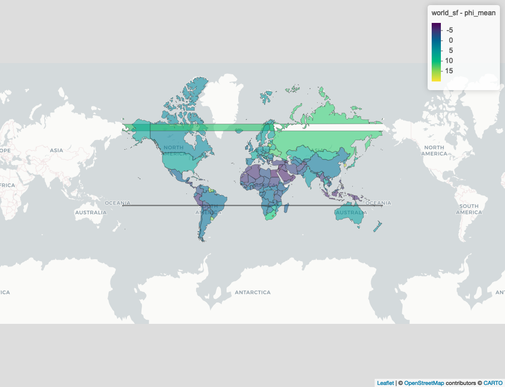

Members: Minh 33077769 Jana 87884193

```{r setup, include = TRUE}
options(repos = c(CRAN = "https://cloud.r-project.org"))
knitr::opts_chunk$set(warning = FALSE, message = FALSE, error = TRUE)
library(tidyverse)
theme_set(theme_bw())
require(extraDistr) #need for rdunif
library(dplyr)
suppressPackageStartupMessages(require(rstan))

#libraries for spatial data objects
#install these packages if they're not already installed :)
# install.packages(c("sf", "spdep", "rgdal")) #sf for vector datam-> shapefile
# install.packages("terra")   # for raster data
required_packages <- c("sf", "spdep", "terra", "dplyr", "readr", "rnaturalearth", "rnaturalearthdata")
installed_packages <- rownames(installed.packages())

for (pkg in required_packages) {
  if (!(pkg %in% installed_packages)) {
    install.packages(pkg)
  }
}

library(sf)
library(spdep)
library(terra)
library(dplyr)
library(readr)
library(rnaturalearth)
library(rnaturalearthdata)

#For fuzzy matching rnaturalearthdata country names to our dataset's country names
install.packages("fuzzyjoin")
library(fuzzyjoin)

```

# Introduction

Mental health has become an increasingly important topic and suicide
remains a significant public health concern worldwide, with rates
varying across regions due to complex social, economic, and cultural
factors. Therefore, understanding the geographic distribution of suicide
rates may be important for the development of targeted mental health
policies and preventative measures. Although place of habitation clearly
affect mental and physical lifestyles, there have few studies conducted
on the geographical relationship between suicide rates and mental
well-being.

In this study, we apply a Bayesian hierarchical model with a
conditionally autoregressive (CAR) prior to investigate spatial patterns
in suicide rates across countries. We model the suicide rate as a
continuous outcome using a Gaussian likelihood, with a global intercept,
a temporal effect comparing 2019 and 2021, and spatial random effects
that capture regional deviationas.

Our analysis focuses specifically on the years2019 and 2021, to
investigate any observable changes in suicide patterns potentially
influenced by global events like the COVID-19 pandemic. Inference is
performed using MCMC sampling in Stan. Our main research question is:
Are there identifiable spatial patterns that persist after taking global
and temporal effects into account, and did suicide rates change
significantly between 2019 and 2021 at a global level?

This approach allows us to identify high-risk regions, quantify
uncertainty, and better understand how neighboring countries may
influence each other’s suicide rates. Valuable insights from this
analysis may provide the opportunity to create more data-informed mental
health interventions.

The GitHub repository can be found at the following link:
<https://github.com/minhVu03/Bayesian-Data-Analysis-Project>

# Literature Review

## TO DO

A similar study on the relationship between location and suicide has
been conducted, but the data was limited to regions in London and with
the rise of social media and the global pandemic, the information may
now be outdated (Congdon, P., 1997). In comparison, our dataset contains
over 180 countries and the analysis focuses on 2021, which may show the
impact of the COVID-19 pandemic on suicide rates.

"The social restriction practices and policies imposed by different
countries secondary to the COVID-19 pandemic might have negatively
influenced the fore-said risk factors that has been indirectly led
increased rates of suicidal attempts and deaths" (Pathirathna et al.,
2022).

# Dataset and Data Cleaning

Dataset Name: Crude Suicide Rate (Per 100,000 Population)

Source:
<https://www.who.int/data/gho/data/themes/mental-health/suicide-rates>

Description: The raw dataset has notable features like country, age
group, sex, and suicide rate (per 100,000 people) that can be extracted.

Location: Country name

Period: Year (2019, 2021)

Dim1: Sex ("Female", "Both sexes", "Male)

FactValueNumeric: Number of suicide deaths in a year, divided by the
population and multiplied by 100 000 (as indicated in the original data
source)

FactValueNumericLow: Low estimate

FactValueNumericHigh: High estimate

Note: The FactValueNumeric data are estimates of the number of suicides.
"The estimates are derived from the WHO Global Health Estimates (GHE)"
[data source]. However, some countries may not have an accurate way of
recording the exact number of deaths, potentially leading to inaccurate
estimations. Hence there is a high and low in the death rates. "For
countries without high-quality death registration data, cause of death
estimates are calculated using other data, including household surveys
with verbal autopsy, sample or sentinel registration systems, special
studies" [data source].

```{r}
data_raw = read.csv("suicide_rate_raw.csv", header = TRUE)
#filter out "both sexes" to avoid duplication
data = as.data.frame(data_raw |> select(Location, Period, Dim1, FactValueNumeric, FactValueNumericLow, FactValueNumericHigh) |> filter(Dim1 %in% c("Female", "Male")) |> filter(Period %in% c(2019,2021)))
unique(data$Period)
# unique(data$Location)
max(data$FactValueNumeric)
min(data$FactValueNumeric)

nrow(data)

```

The dataset after filtering consists of 740 observations.

<!-- filter data to only include 2019 and 2021 -->

<!-- ```{r} -->

<!-- suicide_2019 <- filter(data, Period == 2019) -->

<!-- suicide_2021 <- filter(data, Period == 2021) -->

<!-- ``` -->

# Data Analysis

As we have obtained the cleaned data for suicide rates in 2019 and 2021,
we can now declare a prior model from information obtained historically.

## **Model**

Priors:

$\mu \sim \mathcal{N}(9.2, 3)$

$\beta \sim \mathcal{N}(0, 1)$

$\sigma_\phi \sim \text{Exp}(1)$

$\sigma \sim \text{Exp}(1)$

$\phi_{\text{node1}[i]} - \phi_{\text{node2}[i]} \sim \mathcal{N}\left(0, \sigma_\phi^2\right) \quad \text{for } i = 1, \ldots, N_{\text{edges}}$

$\sum_{r=1}^R \phi_r^2 \sim \mathcal{N}\left(0, R \cdot \sigma_\phi^2\right)$

Likelihood:

$y_n \sim \mathcal{N}(\mu + \beta \cdot t_n + \phi_{r_n}, \sigma) \quad \text{for } n = 1, \ldots, N$

In 2020, the global average suicide rate was 9.2 people per 100,000
people (World Health Organization, n.d.). Therefore, we've chosen this
as the mean for our prior on the estimate of the global suicide rate
$\mu$. Additionally, a standard deviation of 3 allows for reasonable
uncertainty around the average without being overly tight.

The $\beta$ parameter represents the effect of time, for which we've
chosen a weakly information parameter. **NOTE/QUESTION/TODO: the initial
prior we picked was normal(0.1, 0.05) based on research so we did we
change this to (0,1)?**

The prior on both the standard deviation of spatial effects
$\sigma_\phi$ and the observation noise $\sigma$ is $Exp(1)$, which
allows for smaller, more reasonable standard deviations. We've chosen to
use weakly informative parameters here.

## Get Adjacency Pairs

Firstly we need to know which countries are neighbors of each other
<https://cran.r-project.org/web/packages/rnaturalearth/vignettes/rnaturalearth.html>

During the data analysis process we realized that the country names in
our dataset did not match with the country names of the
rnaturalearthdata dataset that we are using to model the spatial data.
This led to the model mistaking the countries as having no neighbors and
producing nodes with values 0. To solve this, we renamed the country
names in our dataset to match that of rnaturalworld's

```{r}
# unique(data$Location)
# unique(world_sf$admin)

data_cleaned <- data %>%
  mutate(Location = case_when(
    Location == "Viet Nam" ~ "Vietnam",
    Location == "Türkiye" ~ "Turkey",
    Location == "Iran (Islamic Republic of)" ~ "Iran",
    Location == "Russian Federation" ~ "Russia",
    Location == "Republic of Korea" ~ "South Korea",
    Location == "Syrian Arab Republic" ~ "Syria",
    Location == "Brunei Darussalam" ~ "Brunei",
    Location == "Netherlands (Kingdom of the)" ~ "Netherlands",
    Location == "Republic of Moldova" ~ "Moldova",
    Location == "Lao People's Democratic Republic" ~ "Laos",
    Location == "United Kingdom of Great Britain and Northern Ireland" ~ "United Kingdom",
    Location == "Venezuela (Bolivarian Republic of)" ~ "Venezuela",
    Location == "Bolivia (Plurinational State of)" ~ "Bolivia",
    Location == "Democratic People's Republic of Korea" ~ "North Korea",
    Location == "Micronesia (Federated States of)" ~ "Federated States of Micronesia",
    Location == "Cote d'Ivoire" ~ "Ivory Coast",
    Location == "Eswatini" ~ "eSwatini",
    Location == "Timor-Leste" ~ "East Timor",
    Location == "occupied Palestinian territory, including east Jerusalem" ~ "Palestine",
    Location == "Sao Tome and Principe" ~ "São Tomé and Principe",
    Location == "Bahamas" ~ "The Bahamas",
    Location == "Congo" ~ "Republic of the Congo",
    Location == "Serbia" ~ "Republic of Serbia",
    TRUE ~ Location  # keep all other names unchanged
  ))
#Search for country names in both datasets for debugging and filtering names
#subset(data_cleaned, grepl("Singapore", Location, ignore.case = TRUE))
# unique(subset(world_sf, grepl("Singapore", admin, ignore.case = TRUE)))

```

Now we can join the two datasets so our original dataset will have
adjacency parameters from world_sf

```{r}
#From rnaturalearth dataset
world_sf <- ne_countries(scale = "medium", returnclass = "sf") %>%
  st_make_valid() %>%
  filter(admin %in% data_cleaned$Location) %>%
  arrange(admin)  # ensure a consistent order

world_sf$region_id <- 1:nrow(world_sf)

data_matched <- data_cleaned %>%
  filter(Location %in% world_sf$admin) %>%
  left_join(world_sf %>% st_drop_geometry() %>% select(admin, region_id),
            by = c("Location" = "admin"))

stopifnot(all(!is.na(data_matched$region_id)))

any(world_sf$region_id == 0)


```

## Convert Neighbor List to Adjacency Pairs

```{r}
world_sp <- as(world_sf, "Spatial")

#### making neighbors!!
neighbors <- poly2nb(world_sp, row.names = world_sf$region_id)

num_neighbors <- sapply(neighbors, length)
R <- length(neighbors)

#regions with at least one neighbor -> we want to leave out countries with no neighbors
valid_indices <- which(num_neighbors > 0)

node1 <- c()
node2 <- c()

for (i in valid_indices) { #only make nodes for countries with neighbors
  for (j in neighbors[[i]]) {
    if (j != 0 && world_sf$region_id[j] != 0) { #i purposely excluded zeros so node2 doesnt have 0 "indexing" from region_id in world_sf
      node1 <- c(node1, world_sf$region_id[i])
      node2 <- c(node2, world_sf$region_id[j])
    }
  }
}

stopifnot(!any(node2 == 0))
length(node1)
length(node2)
any(node2==0) #a lot of debugging led to this being false


```

## STAN Data List

```{r}
nrow(data_matched)
stan_data <- list(
  N = nrow(data_matched),
  y = data_matched$FactValueNumeric,
  time = as.integer(data_matched$Period == 2021), #remove this
  R = R,
  region = data_matched$region_id,
  N_edges = length(node1),
  node1 = node1,
  node2 = node2,
  num_neighbors = num_neighbors
)

```

Extract posterior data from STAN code file Code reference:
<https://ubc-stat-ml.github.io/web447/w08_mcmc1/topic06_hands_on.html>
Why use iter = 2000 and chains = 4:

```{r, message = FALSE, results = 'hide'}
#setwd("C:/Users/Minh/OneDrive/Documents/Bayesian-Data-Analysis-Project")
verbose=FALSE
model <- stan_model(file = "model.stan")
fit <- sampling(model, data = stan_data, iter = 4000, warmup = 2000, chains = 4, seed = 123)
print(fit)
```

!!! TODO- evaluation of posterior, e.g. "An appropriate combination of
diagnostics, synthetic datasets and other validation strategies."

## Model Diagnostics

```{r}
library(ggplot2)
library(bayesplot)

head(summary(fit)$summary)

mcmc_trace(as.array(fit), pars = c("mu", "sigma", "sigma_phi"))

```

```{r}
summary(fit, pars = "mu")$summary

```

## Posterior Visualization

```{r}
install.packages("webshot")
webshot::install_phantomjs()

# Extract posterior samples for 'phi' (spatial random effects)
phi_samples <- rstan::extract(fit)$phi

# Calculate posterior mean of phi for each region
phi_mean <- apply(phi_samples, 2, mean)

# Add phi_mean to the world_sf dataset
world_sf$phi_mean <- phi_mean

# Visualize the posterior mean of phi on the map
library(mapview)
library(webshot)
library(htmlwidgets)

m <- mapview(world_sf, zcol = "phi_mean")
mapshot(m, file = "phi_map.png")

#  # include in PDF output, comment this out to see interactive map

```

# **Discussion**

## **Results**

TODO!!

## **Limitations**

The spatial prior assumes that nearby countries have similar suicide
rates, so if there are sharp differences between neighboring regions,
the model may over-smooth and underrepresent the true variation.

Additionally, the focus of this analysis is whether or not there is a
spatial relationship between location and suicide rate, but it does not
consider underlying factors, such as culture, mental health resources,
and economic state. For example, the topic of mental health is
considered to be taboo in many countries, resulting in limited access to
mental health resources.

The next step would be to look further into these underlying factors and
determine whether or not there is a relationship between the factor and
suicide rate (e.g. is there a relationship between suicide rate and
lower income households in the United States and Canada?). This can be
combined with information about distribution of suicide rates across sex
and age to give more insight into which subset of groups should be
targeted for suicide prevention methods in certain countries.

# **Member Contributions**

!!!TODO - small paragraph discussing what each member did

# **Appendix**

TODO!! - move all code here at the end

# **References**

Brunsdon, C. (2019). *Using rstan and spdep for spatial modelling.*
RPubs by
RStudio.<https://rstudio-pubs-static.s3.amazonaws.com/243277_01730c1f0a984132bce5d5d25bec62aa.html>

Centers for Disease Control and Prevention. (2022, September 30).
*Suicide increases in 2021 after two years of
decline*.<https://www.cdc.gov/nchs/pressroom/nchs_press_releases/2022/20220930.html>

Congdon, P. (1997). Bayesian models for spatial incidence: A case study
of suicide using the BUGS program. *Health & Place,* 3(4),
229–247.[https://doi.org/10.1016/s1353-8292(97)00017-8](https://doi.org/10.1016/s1353-8292(97)00017-8)

Donegan, C. (2023, October 2). *Custom spatial models with RStan and
geostan.* The Comprehensive R Archive
Network.<https://cran.r-project.org/web/packages/geostan/vignettes/custom-spatial-models.html>

Garnett, M. F., & Curtin, S. C. (2023). Suicide mortality in the United
States, 2001–2021. *NCHS Data Brief No.
464*.<https://doi.org/10.15620/cdc:125705>

Moraga, P. (n.d.). *Bayesian Spatial Models*. Spatial Statistics for
Data Science: Theory and Practice with
R.<https://www.paulamoraga.com/book-spatial/bayesian-spatial-models.html>

Morris, M. (n.d.). *Spatial Models in Stan: Intrinsic Auto-Regressive
Models for Areal Data*. Stan: Software for Bayesian Data
Analysis.<https://mc-stan.org/users/documentation/case-studies/icar_stan.html>

Pathirathna, M. L., Nandasena, H. M., Atapattu, A. M., & Weerasekara, I.
(2022). Impact of the COVID-19 pandemic on suicidal attempts and death
rates: A systematic review. *BMC Psychiatry,*
22*.*<https://doi.org/10.1186/s12888-022-04158-w>

U.S. Department of Health and Human Services. (2025, March). *Suicide.*
National Institute of Mental
Health.<https://www.nimh.nih.gov/health/statistics/suicide>

World Health Organization. (n.d.). *Suicide
Rates*.<https://www.who.int/data/gho/data/themes/mental-health/suicide-rates>
